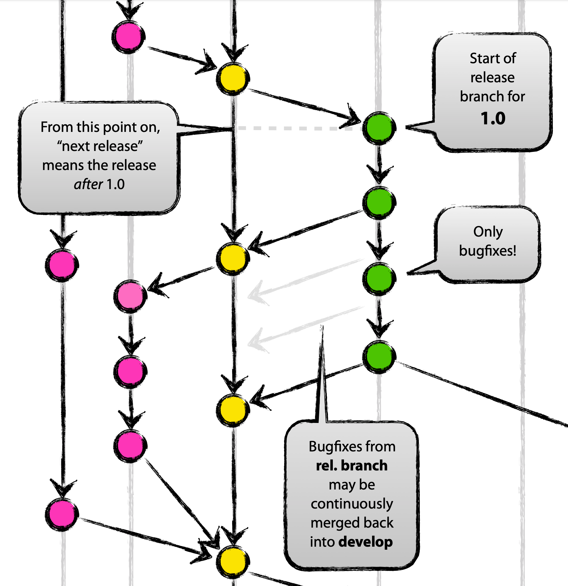

@title[Control your GitHub releases with GitVersion and GitReleaseManager]

[drag=100 20, drop=center, set=h1-blue h3-blue]

## Control your GitHub releases

### with GitVersion and GitReleaseManager

---

@title[Slides and Code]

## Slides

#### https://gep13.me/GitHubReleasesSlides

@fa[plus-square fa-2x fa-pad-icon text-gold]

## Code

#### https://gep13.me/GitHubReleasesCode

---
@title[Agenda]

## Agenda

+++

- What is Semantic Versioning?
- What branching strategy should I use? |
- What is GitVersion? |
- Why do I need GitVersion?  |
- What is GitReleaseManager? |
- Putting it all together... |

---

[drag=30 100, drop=left, bg=black, set=h1-white]

# Q

[drag=70 20, drop=right]

#### What is

## @css[text-gold text-bold](Sematic Versioning )@fa[question]

+++

[drag=30 100, drop=left, bg=lightblue, set=h1-white]

# A

[drag=40 10, drop=60 0, set=text-gray]
Q. What is Semantic Versioning?

[drag=70 70, drop=right, fit=1.4]

> @fa[quote-left]...simple set of rules and requirements that dictate how version numbers are assigned and incremented. These rules are based on, but not necessarily limited to, pre-existing widespread common practices in use in both closed and open-source software.

+++

### The rules

Given a version number MAJOR.MINOR.PATCH, increment the:

- MAJOR version when you make incompatible API changes
- MINOR version when you add functionality in a backwards-compatible manner
- PATCH version when you make backwards-compatible bug fixes

Additional labels for pre-release and build metadata are available as extensions to the MAJOR.MINOR.PATCH format.

+++

### Examples

- 0.1.0
- 1.0.0 |
- 0.3.13 |
- 0.2.0-unstable3  |
- 0.2.0-unstable.3+Branch.develop.Sha.e6eb071cd30974b80d7e237b85e7729a1d791e1e |

---

[drag=30 100, drop=left, bg=black, set=h1-white]

# Q

[drag=70 30, drop=right]

## What
### @css[text-gold text-bold](branching strategy )
### should I use@fa[question]

---

## GitHub Flow

+++

[drag=100, stretch=true, pad=100]

Create a branch

Image borrowed from the <a href="https://guides.github.com/introduction/flow/" target="_blank">GitHub Flow Tutorial</a>

+++

[drag=100, stretch=true, pad=100]

Add commits

Image borrowed from the <a href="https://guides.github.com/introduction/flow/" target="_blank">GitHub Flow Tutorial</a>

+++

[drag=100, stretch=true, pad=100]

Open a Pull Request

Image borrowed from the <a href="https://guides.github.com/introduction/flow/" target="_blank">GitHub Flow Tutorial</a>

+++

[drag=100, stretch=true, pad=100]

Discuss and review your code

Image borrowed from the <a href="https://guides.github.com/introduction/flow/" target="_blank">GitHub Flow Tutorial</a>

+++

[drag=100, stretch=true, pad=100]

Deploy

Image borrowed from the <a href="https://guides.github.com/introduction/flow/" target="_blank">GitHub Flow Tutorial</a>

+++

[drag=100, stretch=true, pad=100]

Merge

Image borrowed from the <a href="https://guides.github.com/introduction/flow/" target="_blank">GitHub Flow Tutorial</a>

---

## GitFlow

+++

[drag=100, pad=100]

Two Main Branches

Image borrowed from the <a href="https://nvie.com/posts/a-successful-git-branching-model/" target="_blank">A successful Git branching model</a> blog post

+++

[drag=100, pad=100]

Feature Branches

Image borrowed from the <a href="https://nvie.com/posts/a-successful-git-branching-model/" target="_blank">A successful Git branching model</a> blog post

+++

[drag=100, pad=100]

Hotfix Branches

Image borrowed from the <a href="https://nvie.com/posts/a-successful-git-branching-model/" target="_blank">A successful Git branching model</a> blog post

+++

[drag=100, pad=100]

Release Branches

Image borrowed from the <a href="https://nvie.com/posts/a-successful-git-branching-model/" target="_blank">A successful Git branching model</a> blog post

+++

[drag=100, pad=100]

Overview

Image borrowed from the <a href="https://nvie.com/posts/a-successful-git-branching-model/" target="_blank">A successful Git branching model</a> blog post

---

[drag=30 100, drop=left, bg=black, set=h1-white]

# Q

[drag=70 20, drop=right]

#### What is

## @css[text-gold text-bold](GitVersion )@fa[question]

+++

[drag=30 100, drop=left, bg=lightblue, set=h1-white]

# A

[drag=40 10, drop=60 0, set=text-gray]
Q. What is GitVersion?

[drag=70 70, drop=right, fit=1.4]

> @fa[quote-left]...is a tool to help you achieve Semantic Versioning on your project.

+++

### Ok, but really, what is it?

---

[drag=30 100, drop=left, bg=black, set=h1-white]

# Q

[drag=70 20, drop=right]

#### Why do I need

## @css[text-gold text-bold](GitVersion )@fa[question]

+++

[drag=100, stretch=true, pad=100]

+++

[drag=100, stretch=true, pad=100]

+++

[drag=100, stretch=true, pad=100]

+++

# ?

---

[drag=30 100, drop=left, bg=black, set=h1-white]

# Q

[drag=70 20, drop=right]

#### Why do I need

## @css[text-gold text-bold](GitReleaseManager )@fa[question]

+++

[drag=30 100, drop=left, bg=lightblue, set=h1-white]

# A

[drag=40 10, drop=60 0, set=text-gray]
Q. What is GitReleaseManager?

[drag=70 70, drop=right, fit=1.4]

> @fa[quote-left]...is a tool that will help create a set of release notes for your application/product. It does this using the collection of issues which are stored on the GitHub Issue Tracker for your application/product.

+++

### Ok, but really, what is it?

---

## Putting it all together...

+++?color=beige

### Demo

---

@title[Questions]

## Questions

Feel free to get in touch

Email: gep13@gep13.co.uk

Twitter: @gep13

Web: https://www.gep13.co.uk

---?color=#7FDBFF
@title[Who Am I? - Gary Ewan Park]

[drag=20 10, drop=topleft]
#### Who am I?

[drag=50 30, drop=0 10, flow=row]

Senior Software Engineer @ Chocolatey Software

[drag=50 50, drop=0 30, flow=row]

[drag=50 10, drop=bottomleft, flow=row, fit=0.5]

@fa[twitter twitter-blue]&nbsp;&nbsp;gep13&nbsp;&nbsp;&nbsp;&nbsp;&nbsp;
@fa[github text-black]&nbsp;&nbsp;github.com/gep13&nbsp;&nbsp;&nbsp;&nbsp;&nbsp;
@fa[home text-blue]&nbsp;&nbsp;gep13.co.uk&nbsp;&nbsp;&nbsp;&nbsp;&nbsp;
@fa[envelope choco-blue]&nbsp;&nbsp;gary@chocolatey.io

[drop=right]

Gary Ewan Park

+++

@title[Learn More]

## Learn More

@ul[text-08](false)

- GitVersion Documentation
  - https://gitversion.net/docs/
- .Net Rocks Episode with Jake Ginnivan
  - https://www.dotnetrocks.com/default.aspx?showNum=1178
- Git Branching Strategies
  - https://www.atlassian.com/git/tutorials/comparing-workflows
- GitFlow
  - https://nvie.com/posts/a-successful-git-branching-model/

@ulend
