## Control your GitHub releases with GitVersion and GitReleaseManager

+++

Gary Ewan Park

Email: gep13@gep13.co.uk

Twitter: @gep13

Web: http://www.gep13.co.uk

---

## Agenda

+++

- What is Semantic Versioning?
- What branching strategy should I use? |
- What is GitVersion? |
- Why do I need GitVersion?  |
- What is GitReleaseManager? |
- Putting it all together... |

---

## What is Semantic Versioning?

+++

### A definition...

"...simple set of rules and requirements that dictate how version numbers are assigned and incremented. These rules are based on, but not necessarily limited to, pre-existing widespread common practices in use in both closed and open-source software."

+++

### The rules

Given a version number MAJOR.MINOR.PATCH, increment the:

* MAJOR version when you make incompatible API changes
* MINOR version when you add functionality in a backwards-compatible manner
* PATCH version when you make backwards-compatible bug fixes

Additional labels for pre-release and build metadata are available as extensions to the MAJOR.MINOR.PATCH format.

+++

### Examples

- 0.1.0
- 1.0.0 |
- 0.3.13 |
- 0.2.0-unstable3  |
- 0.2.0-unstable.3+Branch.develop.Sha.e6eb071cd30974b80d7e237b85e7729a1d791e1e |

---

## What branching strategy should I use?

---

## GitHub Flow

+++

Create a branch

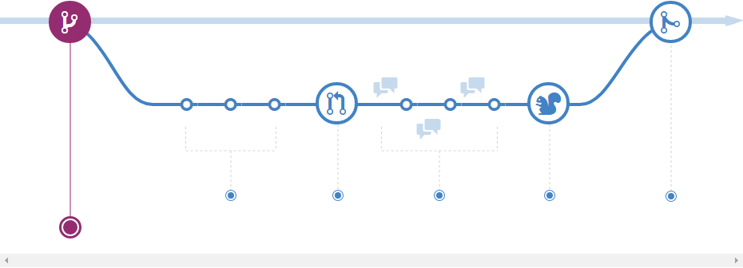

+++

Add commits

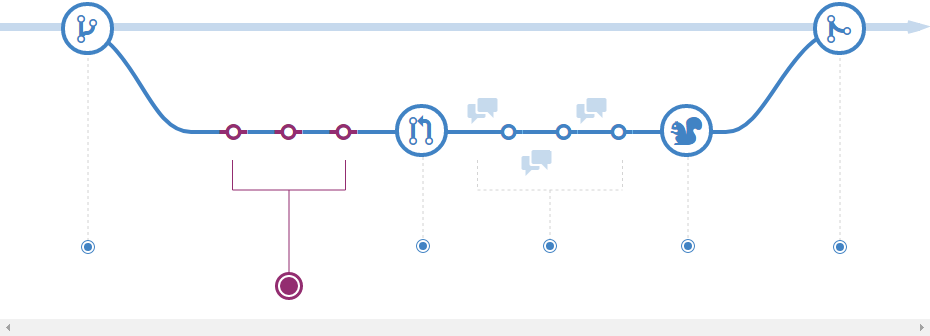

+++

Open a Pull Request

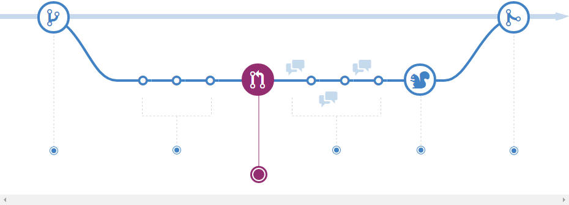

+++

Discuss and review your code

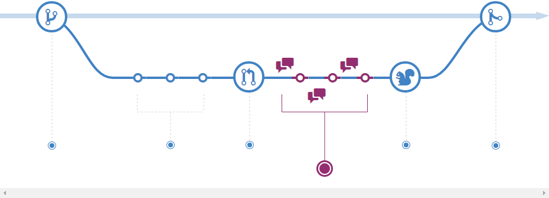

+++

Deploy

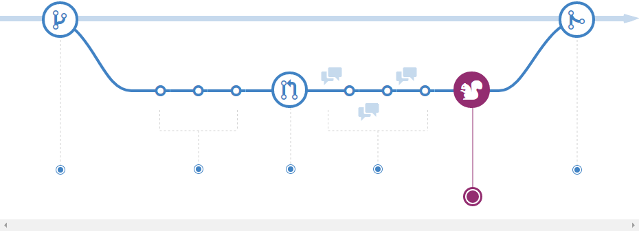

+++

Merge

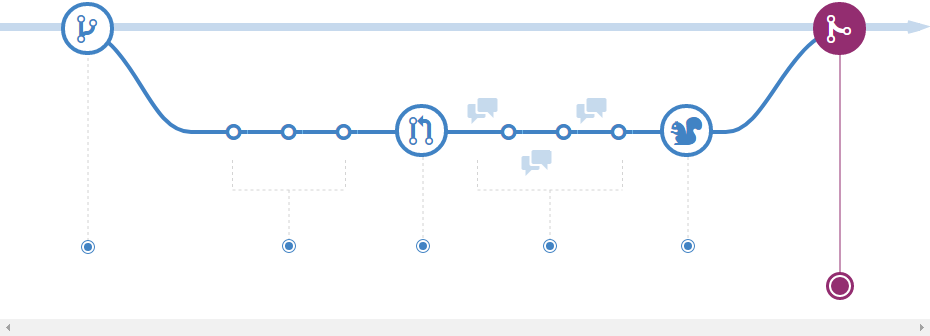

---

## GitFlow

+++

Two Main Branches

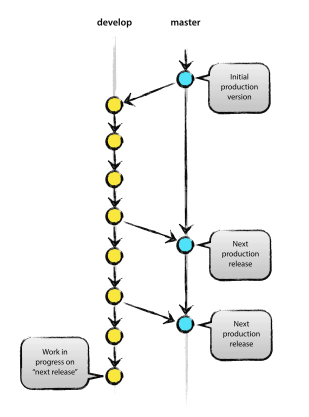

+++

Feature Branches

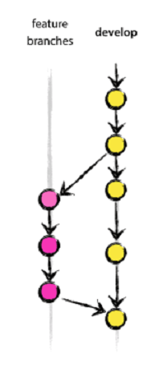

+++

Hotfix Branches

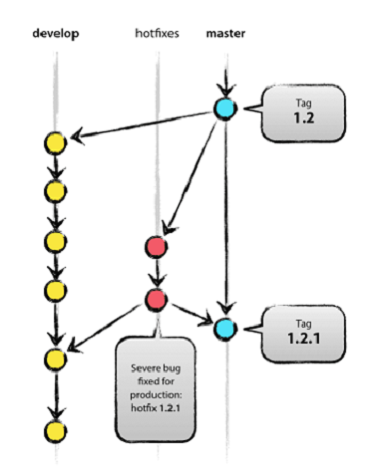

+++

Overview

---

## What is GitVersion?

+++

### A defintion...

"...is a tool to help you achieve Semantic Versioning on your project."

+++

### Ok, but really, what is it?

---

## Why do I need GitVersion?

+++

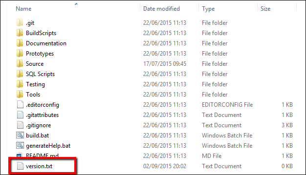

+++

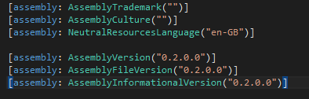

+++

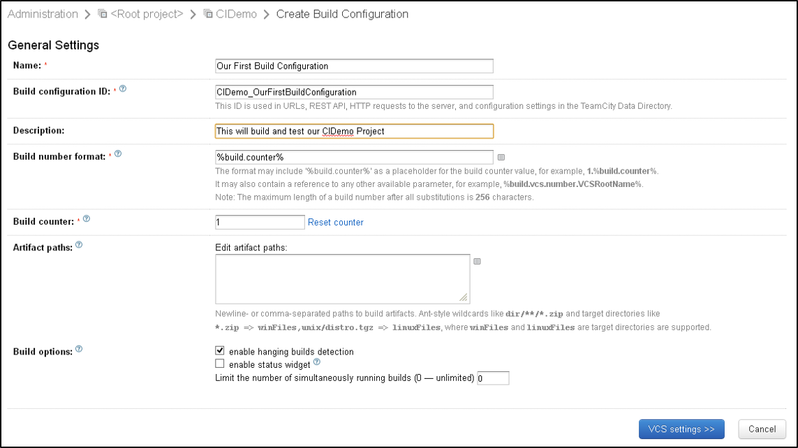

+++

## ?

---

## What is GitReleaseManager?

+++

### A definition...

"...is a tool that will help create a set of release notes for your application/product. It does this using the collection of issues which are stored on the GitHub Issue Tracker for your application/product."

+++

### Ok, but really, what is it?

---

## Putting it all together...

+++

### Demo

---

## Questions?

Feel free to get in touch

Email: gep13@gep13.co.uk

Twitter: @gep13

Web: http://www.gep13.co.uk

---

## Thank you!

---

## Resources

* GitVersion Documentation
  * http://gitversion.readthedocs.org/en/latest/
* .Net Rocks Episode with Jake Ginnivan
  * https://www.dotnetrocks.com/default.aspx?showNum=1178
* Git Branching Strategies
  * https://www.atlassian.com/git/tutorials/comparing-workflows
* GitFlow
  * http://nvie.com/posts/a-successful-git-branching-model/
