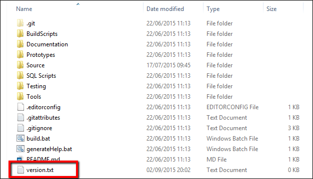
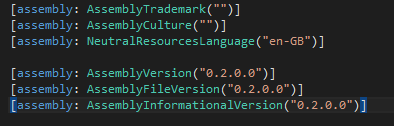

<!--
footer: ""
-->
# **Let's Ship This Thing! :rocket:**
By: Gary Ewan Park

---
<!-- 
paginate: true
class: lead
footer: @gep13
-->
# Slides

https://gep13.me/ShipItSlides

<i class="fa fa-plus-square fa-2x" style="color:#e67d23" aria-hidden="true"></i>

# Code

https://gep13.me/ShipItCode

---
# Agenda
---
* What is Semantic Versioning?
* What branching strategy should I use?
* What is GitVersion?
* Why do I need GitVersion?
* What is GitReleaseManager?
* Putting it all together...

---

#### What is
<h1 style="color:#e67d23"> Semantic Versioning<i class="fa fa-question fa-bold" aria-hidden="true"></i></h1>

---
<!--
header: Q. What is Semantic Versioning?
-->

#### <i class="fa fa-quote-left" aria-hidden="true"></i> ...a simple set of rules and requirements that dictate how version numbers are assigned and incremented. These rules are based on, but not necessarily limited to, pre-existing widespread common practices in use in both closed and open-source software.

---

<!--
header: ""
-->
## The Rules

Given a version number MAJOR.MINOR.PATCH, increment the:

- MAJOR version when you make incompatible API changes
- MINOR version when you add functionality in a backwards-compatible manner
- PATCH version when you make backwards-compatible bug fixes

Additional labels for pre-release and build metadata are available as extensions to the MAJOR.MINOR.PATCH format.

---

## Examples

- 0.1.0
- 0.3.13
- 1.0.0
- 0.2.0-unstable3
- 0.2.0-unstable.3+Branch.develop.Sha.e6eb071cd30974b80d7e237b85e7729a1d791e1e

---

#### What
<h1 style="color:#e67d23">branching strategy</h1>

### should I use<i class="fa fa-question fa-bold" aria-hidden="true"></i>

---

# GitHub Flow

---

<!--
footer: Image borrowed from the [GitHub Flow Tutorial](https://guides.github.com/introduction/flow/)
-->

---
<!--
footer: @gep13
-->

# GitFlow

---

<!--
footer: Image borrowed from  [A successful Git branching model](https://nvie.com/posts/a-successful-git-branching-model/)
-->

---
<!--
header: Q. What branching strategy should I use?
footer: @gep13
-->

#### It depends!

---
<!--
header: ""
-->

#### What is
<h1 style="color:#E67D23">GitVersion<i class="fa fa-question fa-bold" aria-hidden="true"></i></h1>

---

<!--
header: Q. What is GitVersion?
-->

#### <i class="fa fa-quote-left" aria-hidden="true"></i>...a tool to help you achieve Semantic Versioning on your project.

---

<!--
header: ""
-->

## Ok, but really what is it?

---
<!--
header: ""
-->

#### Why do I need
<h1 style="color:#E67D23">GitVersion<i class="fa fa-question fa-bold" aria-hidden="true"></i></h1>

---

---

---

---

## <!--fit-->?

---

<!--
header: Q. Why do I need GitVersion?
-->

### To make version assertion reliable and consistent

---

<!--
header: ""
-->

#### What is
<h1 style="color:#E67D23">GitReleaseManager<i class="fa fa-question" aria-hidden="true"></i></h1>

---

<!--
header: Q. What is GitReleaseManager?
-->

#### <i class="fa fa-quote-left" aria-hidden="true"></i> a tool that will help create a set of release notes for your application/product. It does this using the collection of issues which are stored on the GitHub Issue Tracker for your application/product.

---

<!--
header: ""
-->

## Ok, but really what is it?

---

## Putting is all together...

---
<!--
_backgroundColor: 
-->
## <!-- fit -->Demo

---

## <!-- fit -->Questions

---

## Gary Ewan Park
<h4 style="color:#E67D23">Principal Software Engineer Chocolatey Software, Inc</h4>

- <i class="fa-brands fa-twitter"></i> Twitter: [@gep13](https://twitter.com/gep13)
- <i class="fa-brands fa-mastodon"></i> Mastodon: [@gep13@mastodon.social](https://mastodon.social/@gep13)
- <i class="fa fa-window-maximize"></i> Blog: https://gep13.co.uk
- <i class="fa-brands fa-github"></i> GitHub: [gep13](https://github.com/gep13)

---
## Learn More

- GitVersion Documentation
  - https://gitversion.net/docs/
- GitReleaseManager Documentation
  - https://gittools.github.io/GitReleaseManager/docs/
- .Net Rocks Episode with Jake Ginnivan
  - https://www.dotnetrocks.com/default.aspx?showNum=1178
- Git Branching Strategies
  - https://www.atlassian.com/git/tutorials/comparing-workflows
- GitFlow
  - https://nvie.com/posts/a-successful-git-branching-model/