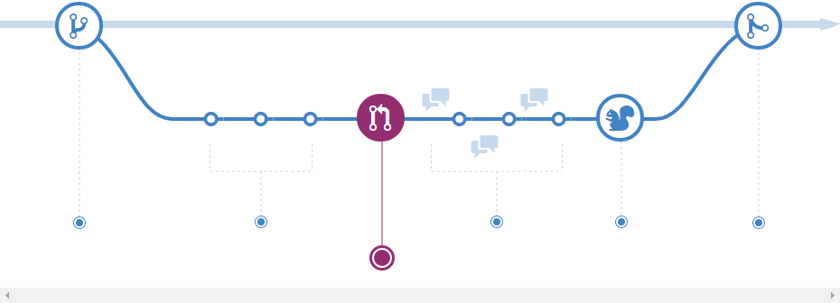
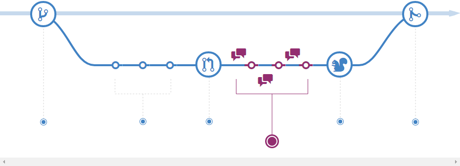
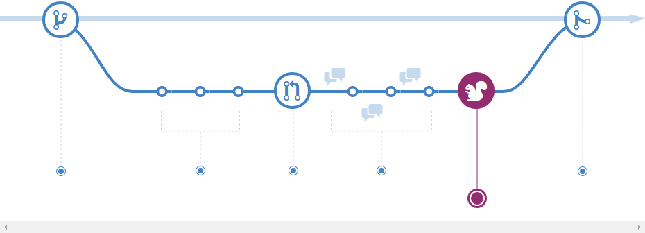

<!--
footer: ""
-->

# **Let's Ship This Thing! :rocket:**
By: Gary Ewan Park
 

<!--
- We have all been here
- We are excited to ship the next version
  - What is in it?
  - What problems have we solved?
  - What bugs have we addressed?
  - What features are we excited about shipping?
  - How do we communicate these to our end users?
-->

---

<!--
footer: "@gep13"
paginate: true
style: |
  .columns {
    display: grid;
    grid-template-columns: repeat(2, minmax(0, 1fr));
    gap: 1rem;
  }
-->

# Slides

https://gep13.me/ShipItSlides

# Code

https://gep13.me/ShipItCode

<!--
- Cake build script sample for running GitVersion and GitReleaseManager is in the repository
-->

---

# Agenda

* What is an issue?
* What is Semantic Versioning?
* What branching strategy should I use?
* What is GitVersion?
* What is GitReleaseManager?

<!--
- Fundamental principal - traceability and communication
  - What version number does it have?
  - What issues/pull requests are associated with it?
-->

---

#### What is an
<h1 style="color:#e67d23"> issue<i class="fa fa-question fa-bold" aria-hidden="true"></i></h1>

---

<!--
footer: ""
paginate: false
backgroundImage: ""
backgroundColor: #f5f5dc
-->

## <!-- fit -->Demo

<!--
- Single point of truth for information
  - Both for developers and users
  - Where we can trace changes associated with the issue
  - Where we can communicate changes about the issue
-->

---

<!--
header: Q. What is an issue?
footer: "@gep13"
paginate: true
backgroundImage: url('./assets/images/hero-background.svg')
backgroundColor: #fff
-->

#### <i class="fa fa-quote-left" aria-hidden="true"></i> ...it is the focal point for work undertaken on a particular task/bug/feature in a product release.

---

<!--
header: ""
-->

#### What is
<h1 style="color:#e67d23"> Semantic Versioning<i class="fa fa-question fa-bold" aria-hidden="true"></i></h1>

---

<!--
header: Q. What is Semantic Versioning?
-->

#### <i class="fa fa-quote-left" aria-hidden="true"></i> ...a simple set of rules and requirements that dictate how version numbers are assigned and incremented. These rules are based on, but not necessarily limited to, pre-existing widespread common practices in use in both closed and open-source software.

<!--
- Loaded topic - large discussion
- Not going into the details
-->

---

<!--
header: ""
-->

## The Rules

Given a version number MAJOR.MINOR.PATCH, increment the:

- MAJOR version when you make incompatible API changes
- MINOR version when you add functionality in a backwards-compatible manner
- PATCH version when you make backwards-compatible bug fixes

Additional labels for pre-release and build metadata are available as extensions to the MAJOR.MINOR.PATCH format.

<!--
- A semantic version number expresses the intention of the release
- What has changed since the last version
-->

---

## Examples

* 0.1.0
* 0.3.13
* 1.0.0
* 0.2.0-alpha.3
* 0.2.0-alpha.3+Branch.develop.Sha.e6eb071cd30974b80d7e237b85e7729a1d791e1e

<!--
- Final example here has ALL information needed for the purposes of traceability
- Most common to have both a "short" version for normal usage, and use the full version as an informational version
-->

---

#### How do you know
<h1 style="color:#e67d23">when to bump</h1>

### a version number<i class="fa fa-question fa-bold" aria-hidden="true"></i>

---

# Tools

* [PublicApiGenerator](https://www.nuget.org/packages/PublicApiGenerator)
* [Microsoft.CodeAnalysis.PublicApiAnalyzers](https://www.nuget.org/packages/Microsoft.CodeAnalysis.PublicApiAnalyzers)

<!--
- There is no magic bullet here
- These tools definitely help in keeping you "honest" about the changes going into a given release
- There may be marketing reasons why a certain version number is needed
-->

---

<!--
header: Q. How do you know when to bump a version number?
-->

##### There is no quick answer 😿

---

<!--
header: ""
-->

#### What
<h1 style="color:#e67d23">branching strategy</h1>

### should I use<i class="fa fa-question fa-bold" aria-hidden="true"></i>

<!--
- Again a loaded topic
-->

---

# GitHub Flow

<!--
- This is the simpler of the two strategies that I am going to show
-->

---

<!--
footer: Images borrowed from the [GitHub Flow Tutorial](https://guides.github.com/introduction/flow/)
-->

##### Create a branch

---

##### Add commits

---

##### Open a Pull Request

---

##### Discuss and review your code

---

##### Deploy

---

##### Merge

---

<!--
footer: "@gep13"
-->

# GitFlow

<!--
- This is the more complicated strategy, but also the one that I prefer
-->

---

<!--
footer: Images borrowed from  [A successful Git branching model](https://nvie.com/posts/a-successful-git-branching-model/)
-->

---

<!--
- Even though it appears more complicated
- Once you break it down, the process is very similar to GitHub Flow
  - If you squint your eyes a bit!
-->

---

<!--
header: Q. What branching strategy should I use?
footer: "@gep13"
-->

#### It depends! 🤷

<!--
- Again, there is no magic bullet
- Pick the workflow that works for your team
- Document it, so that everyone knows what to expect
-->

---

<!--
header: ""
-->

#### What is
<h1 style="color:#E67D23">GitVersion<i class="fa fa-question fa-bold" aria-hidden="true"></i></h1>

---

<!--
header: Q. What is GitVersion?
-->

#### <i class="fa fa-quote-left" aria-hidden="true"></i>...a tool to help you achieve Semantic Versioning on your project.

<!--
- .Net Framework
- .Net Global Tool
- GitHub Action
- Doesn't help you decide when a version number need to change
-->

---

<!--
header: ""
footer: ""
paginate: false
backgroundImage: ""
backgroundColor: #f5f5dc
-->

## <!-- fit -->Demo

---

<!--
footer: "@gep13"
paginate: true
backgroundImage: url('./assets/images/hero-background.svg')
backgroundColor: #fff
-->

#### Why do I need
<h1 style="color:#E67D23">GitVersion<i class="fa fa-question fa-bold" aria-hidden="true"></i></h1>

---

---

---

<!--
- This couples you to a CI system
-->

---

## <!--fit-->?

<!--
- No idea what the version number is
-->

---

<!--
header: Q. Why do I need GitVersion?
-->

### To make version assertion reliable and consistent

---

<!--
header: ""
-->

#### What is
<h1 style="color:#E67D23">GitReleaseManager<i class="fa fa-question" aria-hidden="true"></i></h1>

---

<!--
header: Q. What is GitReleaseManager?
-->

#### <i class="fa fa-quote-left" aria-hidden="true"></i>...a tool that will help create, and manage, a release for your application/product.

<!--
- Started out as a tool from Particular
- .Net Framework
- .Net Global Tool
- GitHub Action
-->

---

<!--
header: ""
footer: ""
paginate: false
backgroundImage: ""
backgroundColor: #f5f5dc
-->

## <!-- fit -->Demo

---

<!--
footer: "@gep13"
paginate: true
backgroundImage: url('./assets/images/hero-background.svg')
backgroundColor: #fff
-->

## Gary Ewan Park
<h4 style="color:#E67D23">Principal Software Engineer Chocolatey Software, Inc</h4>

- <i class="fa-brands fa-twitter"></i> Twitter: [@gep13](https://twitter.com/gep13)
- <i class="fa-brands fa-mastodon"></i> Mastodon: [@gep13@mastodon.social](https://mastodon.social/@gep13)
- <i class="fa fa-window-maximize"></i> Blog: https://gep13.co.uk
- <i class="fa-brands fa-github"></i> GitHub: [gep13](https://github.com/gep13)

---

<!--
header: ""
footer: ""
paginate: false
backgroundImage: ""
backgroundColor: #f5f5dc
-->

## <!-- fit -->Questions

---

<!--
footer: "@gep13"
paginate: true
backgroundImage: url('./assets/images/hero-background.svg')
backgroundColor: #fff
-->

## Learn More

- GitVersion Documentation
  - https://gitversion.net/docs/
- GitReleaseManager Documentation
  - https://gittools.github.io/GitReleaseManager/docs/
- Git Branching Strategies
  - https://www.atlassian.com/git/tutorials/comparing-workflows
- GitFlow
  - https://nvie.com/posts/a-successful-git-branching-model/